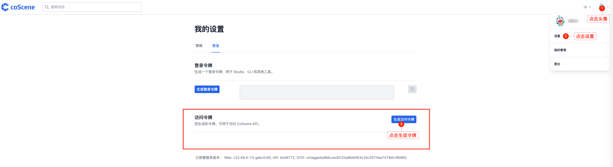
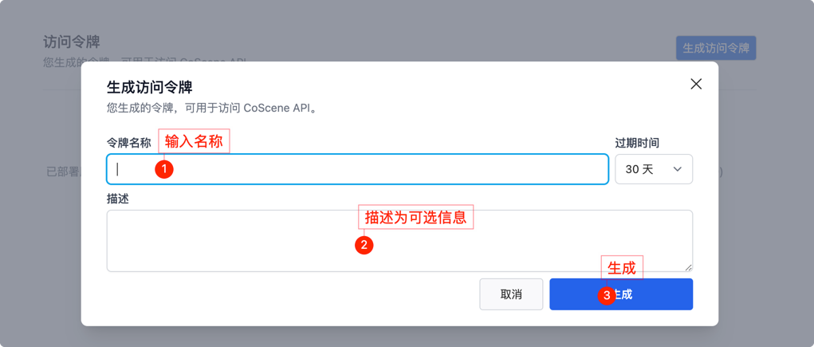
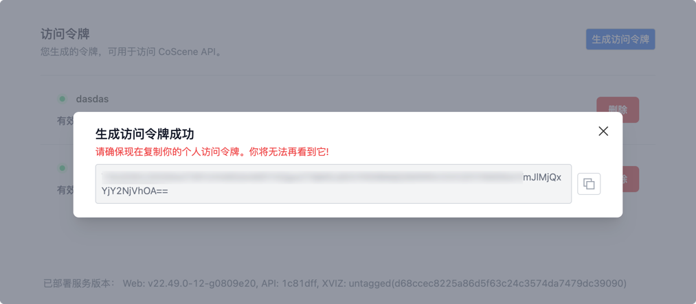
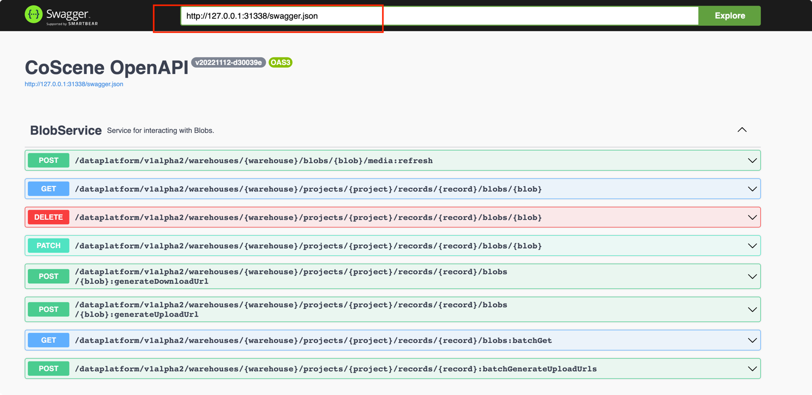

# Sample files to upload

## 环境

Tested with the following setup:

- python 2.7.18 with M1 Arm Chips
- a maximum of 500mb video files

## 依赖

- requests

```shell
pip install requests==2.27.1
```

## 配置
创建一个文件在~/.cos.ini
```ini
[default]
server_url = https://api.coscene.cn
project_slug = <WAREHOUSE/PROJECT>
api_key = <API_KEY>
```
替换上面带尖括号的里的内容

### 从地址栏获得slug


### 从 coscene 网页右上角 点击头像 -> 设置 -> 安全 里生成一个对应的 apikey 使用




## Run
```shell
python cos.py -c ./sample.ini ./samples/2.jpg ./samples/3.jpg
```

## Swagger

1. 启动本地 server，`python server.py` 
2. 浏览器打开网址 [swagger](https://petstore.swagger.io/)
3. 输入地址 `http://127.0.0.1:31338/swagger.json` 查看即可获取到接口文档


