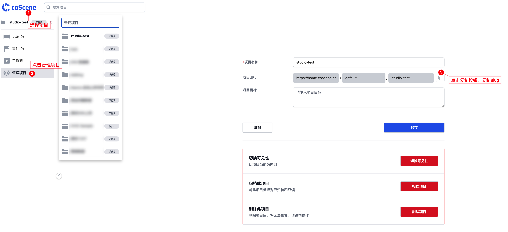
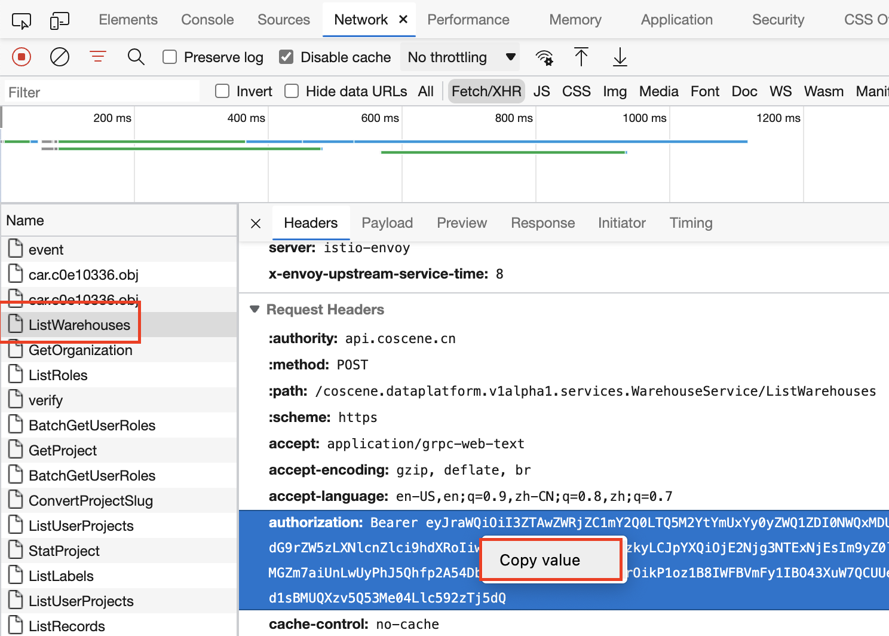

# Sample files to upload

## 环境

Tested with the following setup:

- python 2.7.18 with M1 Arm Chips
- a maximum of 500mb video files

## 依赖

- requests

```shell
pip install requests==2.27.1
```

## 配置
创建一个文件在~/.cos.ini
```ini
[default]
server_url = https://api.coscene.cn
project_slug = <WAREHOUSE/PROJECT>
bearer_token = <BEARER_TOKEN>
```
替换上面带尖括号的里的内容

从地址栏获得slug


从developer工具里找一个对api.coscene.cn调用的请求里找authorization token



## Run
```shell
python cos.py -c ./sample.ini ./samples/2.jpg ./samples/3.jpg
```
